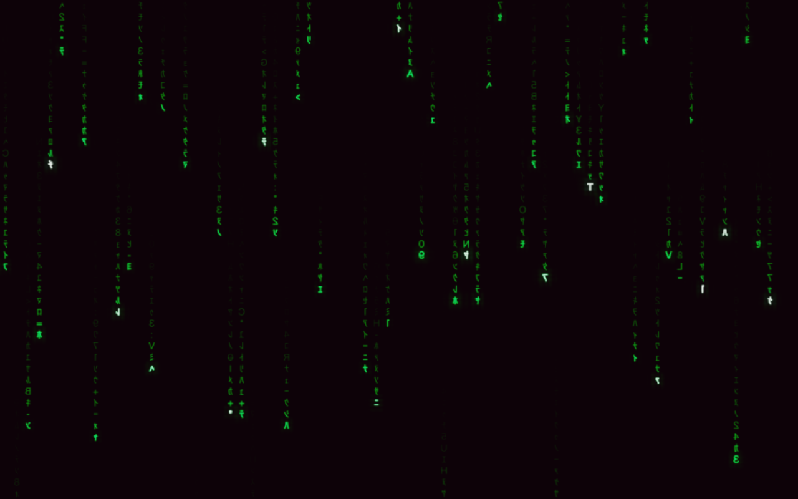
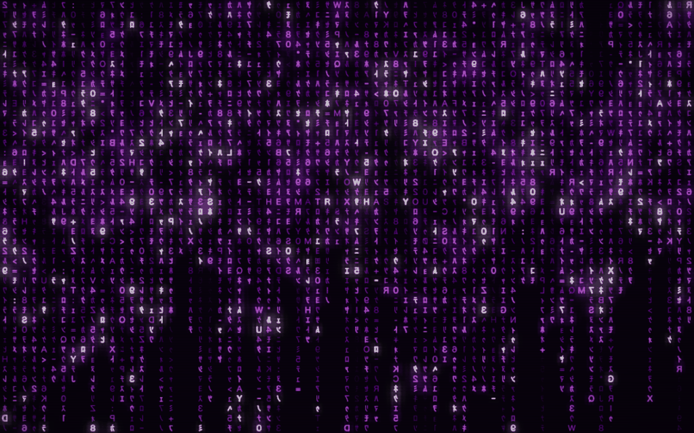
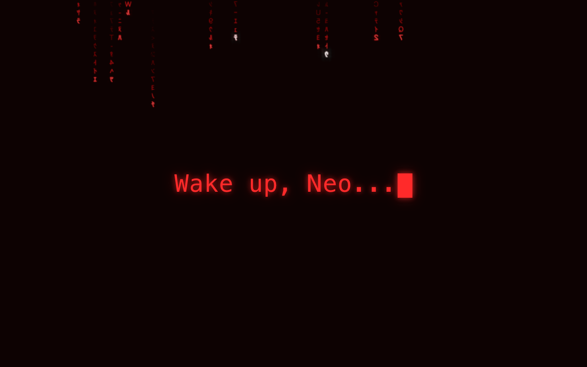
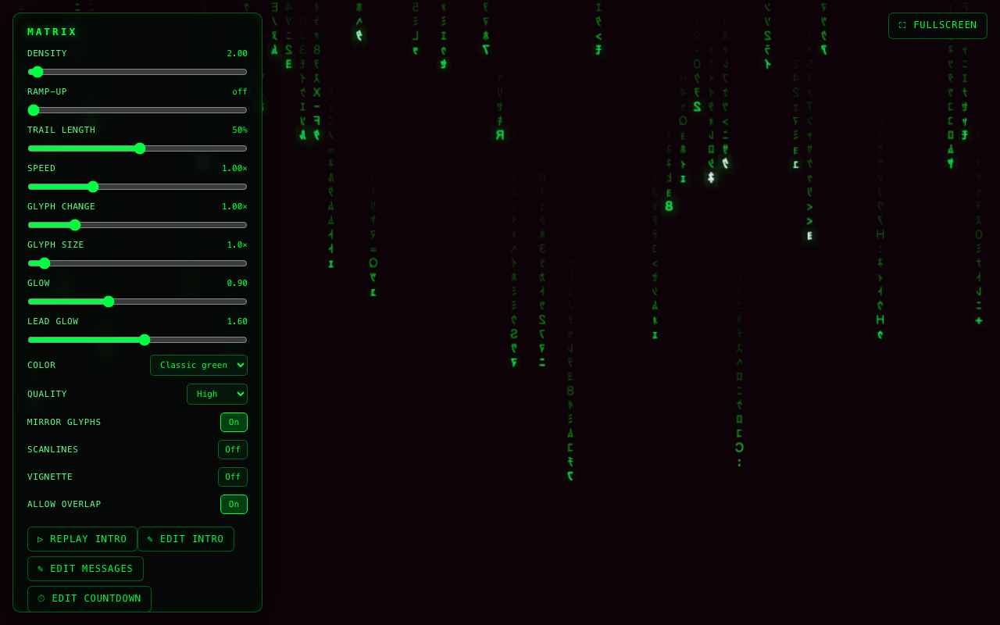

# MatrixCode — Film-Accurate Matrix Digital Rain for the Browser (WebGL)

[](LICENSE)

MatrixCode is an open-source **Matrix digital rain effect** that runs directly in the browser: a full-viewport WebGL "code rain" screensaver, bundled into one self-contained HTML file with no server, no build step, and no external dependencies at runtime. Unlike most Matrix rain demos, the rendering model is film-accurate — glyphs sit on a **stationary grid** and a wave of illumination sweeps down each column, leaving an exponentially decaying trail, rather than scrolling text down the screen.



## Contents

- [Why MatrixCode](#why-matrixcode)
- [Features](#features)
- [Controls](#controls)
- [Getting Started](#getting-started)
- [macOS screen saver](#macos-screen-saver)
- [Architecture](#architecture)
- [License](#license)
- [Screenshots](#screenshots)

## Why MatrixCode

Most "Matrix rain" projects (including the classic terminal `cmatrix`) scroll a column of text downward. MatrixCode instead reproduces how the effect actually works in the films: every glyph cell is fixed in place, and only its *brightness* animates as a wave of light travels down the column and decays behind it. Combined with a single-file, dependency-free build, that makes MatrixCode a good fit for:

- A **Matrix-style screensaver** you can open from a local file or a kiosk browser with no install
- A **digital rain effect** to drop into another site or an art installation, with no bundler or CDN required
- A **multi-monitor Matrix wall** — choose **Multi-monitor** to span the same continuous rain across every connected display

## Features

- **WebGL2 renderer** with multi-level bloom (brightpass → blur → composite), scanlines, and vignette
- **Film-accurate simulation** — stationary glyph grid, wave-of-illumination model, per-cell brightness decay (not scrolling text)
- **Single-file build** — `vite build` produces one inlined `matrixcode.html` with no external dependencies
- **Native macOS screen saver** — a separate AppKit + Metal Apple-Silicon `.saver` bundle with an Options sheet and continuous multi-display rendering
- **Multi-monitor mode** — the **Multi-monitor** button spans the rain across every connected display as one continuous grid (Chromium only; see [docs/multimonitor-setup.md](docs/multimonitor-setup.md))
- **Settings panel** — press `H` to toggle; controls for color theme, quality tier, glyph scale, and more
- **Intro typewriter message** — plays once per visitor; `Escape` or click skips it
- **Canvas 2D fallback** — displayed automatically if WebGL2 is unavailable

## Controls

| Key / Gesture | Action |
|---|---|
| `H` | Toggle settings panel |
| `F` | Toggle fullscreen |
| Double-click | Toggle fullscreen |
| **Multi-monitor** button | Start multi-monitor mode |
| Triple-click | Start multi-monitor mode (shortcut) |
| `Escape` / click | Skip intro message |

## Getting Started

```sh
npm install
npm run dev        # dev server at http://localhost:5188
npm run build      # produces dist/matrixcode.html (single inlined file)
npm run preview    # serve the production build
npm test           # run the Vitest suite
```

The build output, `matrixcode.html`, is a single self-contained file — copy it anywhere and open it directly in a browser, no server required.

## macOS screen saver

The native macOS 13+ project lives in
[`macos/MatrixCodeScreenSaver`](macos/MatrixCodeScreenSaver). It is a completely
independent AppKit + Metal implementation—there is no TypeScript, HTML, WebGL,
or WKWebView in the screen saver bundle. It provides native settings, intro,
messages, countdown/countup tokens, and continuous multi-display rendering, plus
build, test, and manual-install scripts for the Apple-Silicon `MatrixCode.saver`.

```sh
cd macos/MatrixCodeScreenSaver
./test.sh
./build.sh
./install.sh
```

The installed saver is configured from System Settings → Screen Saver →
**MatrixCode** → **Options…**. Its settings intentionally mirror the web app:
rain controls, color presets, quality, glyph behavior, intro script/timing,
in-rain messages, viewer name, and named countdown/countup moments. See
[`macos/MatrixCodeScreenSaver/README.md`](macos/MatrixCodeScreenSaver/README.md)
for native build, install, troubleshooting, and parity notes.

The browser and macOS versions are two separate implementations of the same
feature contract. Changes to visuals, settings, token behavior, intro/messages,
or multi-monitor semantics should be made in both codebases unless an intentional
difference is documented.

## Architecture

MatrixCode currently has two implementations that are kept in behavioral parity:

- **Browser app:** TypeScript + WebGL2 under [`src`](src), producing a single
  static HTML artifact.
- **macOS screen saver:** Objective-C/AppKit + ScreenSaver.framework + Metal
  under [`macos/MatrixCodeScreenSaver`](macos/MatrixCodeScreenSaver), producing
  a native `.saver` bundle with no embedded web runtime.

### Browser app

Data flows in one direction each frame:

1. **`src/sim/rainSim.ts`** — headless CPU simulation; packs per-cell state (brightness, glyph index, phase, head flags) into a `Uint8Array`. DOM-free and seedable, so it is fully unit-testable.
2. **`src/gl/stateTexture.ts`** — uploads the byte array as a GPU texture each frame.
3. **`src/gl/renderer.ts`** — draws glyphs sampling a glyph atlas + state texture, then runs the bloom post-process. Bloom level count scales with the quality tier (`low` / `med` / `high`). Uses `twgl.js` for GL boilerplate.
4. **`src/gl/glyphAtlas.ts`** — rasterizes the glyph set into a texture atlas; rebuilt when the `mirror` control changes.

**Configuration:** `ControlsStore` (`src/config/controls.ts`) is an observable store of user-facing settings. Static tuning lives in `src/config/simConfig.ts`; color themes in `src/config/colorPresets.ts`.

**Multi-monitor mode:** all windows run the same deterministic simulation against a shared seed and `Date.now()` epoch — same clock ⇒ pixel-aligned seams with no per-frame cross-window messaging. A `BroadcastChannel` is used only to coordinate exit. See `src/multimonitor/`.

### Native macOS screen saver

The native saver mirrors the web feature contract with platform-native pieces:

- `Source/MatrixCodeScreenSaverView.*` hosts the ScreenSaver.framework entry
  point and coordinates preview/fullscreen lifecycle.
- `Source/MatrixCodeMetalView.*` owns the Metal renderer, stationary-cell rain,
  overlap lanes, themes, scanlines, vignette, in-rain messages, and continuous
  virtual-grid multi-display mapping.
- `Source/MatrixCodeRainLifecycle.*` mirrors the web load/intro ramp behavior
  and weighted glyph selection.
- `Source/MatrixCodeIntroOverlayView.*` implements the native typewriter intro,
  including token resolution and skip handling.
- `Source/MatrixCodeConfigurationController.*` implements the Options sheet and
  sanitizes/persists the same `mx-*` JSON documents used by the web app.
- `Source/MatrixCodeTokenResolver.*` mirrors the web token grammar for name,
  greeting, time formatting, countdown/countup, named moments, and calendar
  tokens.

Native regression tests live in `macos/MatrixCodeScreenSaver/Tests` and cover
configuration sanitization, token parity, intro behavior, rain lifecycle, Metal
visibility, and multi-display geometry.

## License

[MIT](LICENSE)

## Screenshots

**Color theme, scanlines/vignette, and in-rain messages** — a non-default color preset (purple) at high density with overlap lanes turned off (drops stay grid-aligned to whole columns), scanlines and vignette enabled, and a scheduled message ("THE MATRIX HAS YOU") flickering into the glyph stream.



**Intro typewriter over the load-time density ramp** — the once-per-visitor intro sequence typing out over the red preset while rain builds in from empty at load.



**Settings panel over film-accurate bloom** — the auto-hiding controls panel (`H`) for color theme, quality tier, glyph scale, glow, and more, layered over the stationary-grid rain and multi-level bloom post-process.


