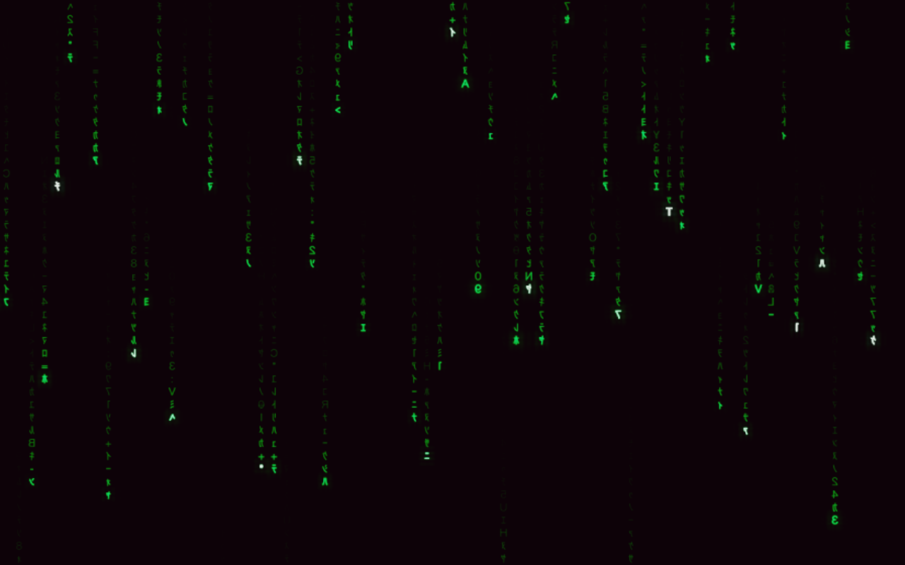
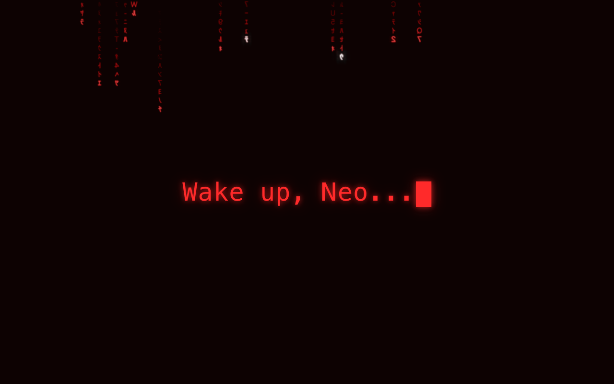
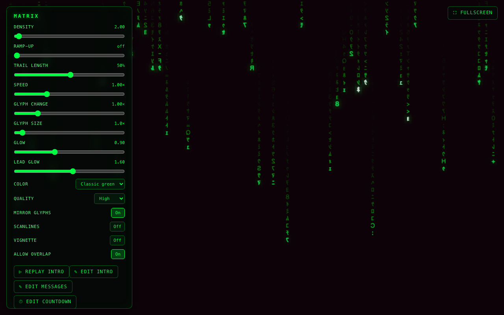

# MatrixCode — Film-Accurate Matrix Digital Rain

[](LICENSE)

MatrixCode is an open-source **Matrix digital rain effect** with a browser/WebGL
implementation as its visual source of truth, independent native screen savers
for macOS and Windows, and a browser-derived Wallpaper Engine package. The web
build is one self-contained HTML file with no server or runtime dependencies.
Unlike most Matrix rain demos, the rendering model is film-accurate — glyphs
sit on a **stationary grid** and a wave of illumination sweeps down each column,
leaving an exponentially decaying trail, rather than scrolling text down the
screen.



## Contents

- [Why MatrixCode](#why-matrixcode)
- [Features](#features)
- [Controls](#controls)
- [Getting Started](#getting-started)
- [Wallpaper Engine](#wallpaper-engine)
- [Windows app and screen saver](#windows-app-and-screen-saver)
- [macOS screen saver](#macos-screen-saver)
- [Architecture](#architecture)
- [License](#license)
- [Screenshots](#screenshots)

## Why MatrixCode

Most "Matrix rain" projects (including the classic terminal `cmatrix`) scroll a column of text downward. MatrixCode instead reproduces how the effect actually works in the films: every glyph cell is fixed in place, and only its *brightness* animates as a wave of light travels down the column and decays behind it. Combined with a single-file, dependency-free build, that makes MatrixCode a good fit for:

- A **Matrix-style screensaver** you can open from a local file or a kiosk browser with no install
- A **digital rain effect** to drop into another site or an art installation, with no bundler or CDN required
- A **multi-monitor Matrix wall** — choose **Multi-monitor** to span the same continuous rain across every connected display

## Features

- **WebGL2 renderer** with multi-level bloom (brightpass → blur → composite), scanlines, and vignette
- **Film-accurate simulation** — stationary glyph grid, wave-of-illumination model, per-cell brightness decay (not scrolling text)
- **Single-file build** — `vite build` produces one inlined `matrixcode.html` with no external dependencies
- **Native macOS screen saver** — a separate AppKit + Metal Apple-Silicon `.saver` bundle with an Options sheet and continuous multi-display rendering
- **Native Windows app and screen saver** — an independent C++20, Win32, and Direct3D 11 implementation that builds a standalone `.exe` and native `.scr`
- **Wallpaper Engine package** — an offline web-wallpaper package generated from the same browser artifact for import into Wallpaper Engine and eventual Workshop publication
- **Multi-monitor mode** — the **Multi-monitor** button spans the rain across every connected display as one continuous grid (Chromium only; see [docs/multimonitor-setup.md](docs/multimonitor-setup.md))
- **Settings panel** — press `H` to toggle; controls for color theme, quality tier, glyph scale, and more
- **Annual holiday colors** — every February 14 uses Red; every March 17 uses Classic Green, based on the computer's local date. Browser (including compatibility mode), Wallpaper Engine, macOS, and Windows switch automatically while running and restore the latest selected theme afterward without overwriting saved settings.
- **Intro typewriter message** — plays on every load while enabled (toggle it in the intro editor); `Escape` or click skips it
- **Image reveals** — imported images resolve through falling rain glyphs using a deterministic, portable luminance-mask contract shared by the web and native implementations
- **Canvas 2D fallback** — displayed automatically if WebGL2 is unavailable

Holiday colors use local midnight boundaries, independently of paused animation or countdown
timing. In Canvas2D compatibility mode, changing palette clears the baked-in fading trails;
the current glyphs and images are redrawn without advancing their timelines.

## Controls

| Key / Gesture | Action |
|---|---|
| `H` | Toggle settings panel |
| `I` / `M` / `C` | Open the intro, messages, or countdown editor |
| `N` or `Shift-M` | Toggle in-rain messages |
| `X` | Open the image-reveal editor |
| `Shift-X` | Toggle image reveals |
| `P` | Pause or resume animation |
| `Alt-F` | Toggle the frame-rate/resolution HUD |
| `-` / `=` | Decrease / increase rain density |
| `F` | Toggle fullscreen |
| Double-click | Toggle fullscreen |
| **Multi-monitor** button | Start multi-monitor mode |
| Triple-click | Start multi-monitor mode (shortcut) |
| `Escape` / click | Skip intro message |

## Getting Started

```sh
npm install
npm run dev        # dev server at http://localhost:5188
npm run build      # produces dist/matrixcode.html (single inlined file)
npm run preview    # serve the production build
npm test           # run the Vitest suite
```

The build output, `matrixcode.html`, is a single self-contained file — copy it anywhere and open it directly in a browser, no server required.

When the viewer name is blank, a build opened from a local macOS `file://` path
uses the home-folder name with its first letter capitalized. Browsers do not
expose the operating-system login to pages served over HTTP, so those pages use
`Neo` until a viewer name is entered or supplied with `?name=`.

## Wallpaper Engine

Wallpaper Engine uses the browser implementation as an offline **web
wallpaper**; the native Windows executable is deliberately not its payload.
Build the importable package from the repository root:

```powershell
npm run verify:wallpaper
npm run build:wallpaper
```

The generated package is written to `dist/wallpaper-engine/`. In Wallpaper
Engine, choose **Create Wallpaper** and import that directory's `index.html`.
The package includes the inlined application, generated `project.json`, preview,
local PWA assets, and MatrixCode/twgl.js license notices. It is suitable for
local import and Workshop preparation;
these build steps do not claim that a Workshop item has been published.

Wallpaper Engine's property pane is authoritative in hosted mode. Its adapter
installs before app bootstrap, merges changed-only property callbacks, obeys the
host FPS and pause lifecycle, and accepts a directory of supported image files.
For one continuous grid across displays, use Wallpaper Engine's **Span** mode.
See [`wallpaper-engine/README.md`](wallpaper-engine/README.md) for the fixed
intro/message/countdown slots, image-folder rules, display behavior, and direct
package verification commands.

## Windows app and screen saver

The Windows 10 version 2004+ project lives in
[`windows/MatrixCode`](windows/MatrixCode). It is an independent C++20 + Win32
implementation using Direct3D 11, Direct2D/DirectWrite, and WIC, with no HTML,
JavaScript, WebGL, or embedded browser runtime. Its CMake targets produce:

- `MatrixCode.exe`, a resizable standalone application;
- `Matrix Code.scr`, a native screen saver supporting `/s`, `/c`, and
  `/p <HWND>` shell modes;
- deterministic native tests and a WARP-backed canonical capture tool.

From a Visual Studio 2022 developer PowerShell with CMake 3.29 or newer:

```powershell
npm run build:windows     # stage an x64 Release build, without running tests
npm run test:windows      # build x64 Debug and run the native test suite
npm run verify:windows    # run the native suite and write a WARP capture
npm run release:windows   # x64 + ARM64 MSI/portable/symbol archives and checksums
```

WiX Toolset v4 is required for MSI/release packaging. Release signing uses the
`MATRIXCODE_SIGN_PFX`, `MATRIXCODE_SIGN_SUBJECT`, or
`MATRIXCODE_SIGN_COMMAND` environment variables. Without a configured backend,
the default release command warns and leaves artifacts unsigned; pass
`-- -RequireSigning` to make it fail closed.

The source tree and automation target x64 and ARM64, but release binaries are
not checked into this repository and must be built and verified on suitable
Windows hosts. The native host includes typed intro presentation, rain
messages, portable image reveals with the full 1.45 HDR range, mixed-DPI
virtual-grid topology, and DPI-aware structured Intro, Messages, Images, and
Countdown editors with WIC image import. Exact output still depends on the
installed DirectWrite fonts. Native compilation/capture, `.scr` shell-mode,
mixed-DPI/mixed-refresh hardware, and signed installer validation remain
release gates rather than results implied by this source checkout. The full
build, installation, verification, and signing details are maintained in
[`windows/MatrixCode/README.md`](windows/MatrixCode/README.md).

## macOS screen saver

The native macOS 13+ project lives in
[`macos/MatrixCodeScreenSaver`](macos/MatrixCodeScreenSaver). It is a completely
independent AppKit + Metal implementation—there is no TypeScript, HTML, WebGL,
or WKWebView in the screen saver bundle. It provides native settings, intro,
messages, countdown/countup tokens, and continuous multi-display rendering, plus
build, test, and manual-install scripts for the Apple-Silicon `Matrix Code.saver`.

```sh
cd macos/MatrixCodeScreenSaver
./test.sh
./build.sh --release  # defaults to Release
./build.sh --debug
./install.sh
```

For a distributable build, run `./scripts/build-release.sh --release` from the
repository root. The script signs with Developer ID, notarizes, and staples the
DMG; `--skip-notarize` omits the Apple round trip, and `--debug` creates a local
Debug build. It detects Xcode even when installed outside `/Applications`,
generates the project in a temporary directory, and writes verified app and
screen-saver packages to `macos/MatrixCodeScreenSaver/build/<Configuration>/`.
The styled `MatrixCode.dmg`, matching dSYMs, executable UUIDs, and checksums are
written alongside them.

The installed saver is configured from System Settings → Screen Saver →
**MatrixCode** → **Options…**. Its settings intentionally mirror the web app:
rain controls, color presets, quality, glyph behavior, intro script/timing,
in-rain messages, image reveals, viewer name, and named countdown/countup
moments. See
[`macos/MatrixCodeScreenSaver/README.md`](macos/MatrixCodeScreenSaver/README.md)
for native build, install, troubleshooting, and parity notes.

The browser, macOS, and Windows versions are separate implementations of the
same feature contract. Changes to visuals, settings, token behavior,
intro/messages/images, or multi-monitor semantics should be made in all
applicable codebases unless an intentional difference is documented.

The testable definition of parity, canonical comparison conditions, and the
scope of the automated verification gate are documented in
[`docs/macos-web-parity.md`](docs/macos-web-parity.md). On a Mac with full
Xcode, run `npm run verify:parity` from the repository root.

## Architecture

MatrixCode has three runtime implementations plus a browser-derived Wallpaper
Engine distribution:

- **Browser app:** TypeScript + WebGL2 under [`src`](src), producing a single
  static HTML artifact.
- **macOS screen saver:** Objective-C/AppKit + ScreenSaver.framework + Metal
  under [`macos/MatrixCodeScreenSaver`](macos/MatrixCodeScreenSaver), producing
  a native `.saver` bundle with no embedded web runtime.
- **Windows app and screen saver:** C++20 + Win32 + Direct3D 11 under
  [`windows/MatrixCode`](windows/MatrixCode), producing a native application and
  `.scr` with no embedded web runtime.
- **Wallpaper Engine:** a host adapter under `src/platform/wallpaperEngine.ts`
  and generated package metadata under [`wallpaper-engine`](wallpaper-engine);
  it runs the browser build rather than introducing a fourth renderer.

### Browser app

Data flows in one direction each frame:

1. **`src/sim/rainSim.ts`** — headless CPU simulation; packs per-cell state (brightness, glyph index, phase, head flags) into a `Uint8Array`. DOM-free and seedable, so it is fully unit-testable.
2. **`src/gl/stateTexture.ts`** — uploads the byte array as a GPU texture each frame.
3. **`src/sim/imageScheduler.ts` and `src/sim/imageReveal.ts`** — schedule image reveals independently from rain motion and convert the active portable mask into deterministic per-cell influence, glyph choice, falling-gate, and edge-feather data.
4. **`src/gl/renderer.ts`** — draws glyphs sampling a glyph atlas + state texture, composites messages and image influence, then runs the bloom post-process. Bloom level count scales with the quality tier (`low` / `med` / `high`). Uses `twgl.js` for GL boilerplate.
5. **`src/gl/glyphAtlas.ts`** — rasterizes the glyph set into a texture atlas; rebuilt when the `mirror` control changes.

**Configuration:** `ControlsStore` (`src/config/controls.ts`) is an observable store of user-facing settings. Static tuning lives in `src/config/simConfig.ts`; color themes in `src/config/colorPresets.ts`. Intro, messages, countdowns, and image reveals use separately sanitized persisted documents.

**Portable image-reveal contract:** `mx-images` stores at most 64 greyscale
masks, each no larger than 96 × 96 cells, as padded Base64 containing exactly
one luminance byte per cell. Importers preserve aspect ratio without upscaling;
the scheduler uses its own deterministic hash sequence so image selection and
placement never perturb rain or message RNG. Appearance/hold/disappearance,
flicker resolve, brightness fade, scale, placement jitter, virtual-grid
coordinates, mask sampling, edge feather, and falling-rain gating are parity
rules shared with native implementations. Web code lives in
`src/config/imagesStore.ts`, `src/sim/imageMask.ts`,
`src/sim/imageScheduler.ts`, and `src/sim/imageReveal.ts`.

**Multi-monitor mode:** all windows run the same deterministic simulation against a shared seed and `Date.now()` epoch — same clock ⇒ pixel-aligned seams with no per-frame cross-window messaging. A `BroadcastChannel` is used only to coordinate exit. See `src/multimonitor/`.

### Native macOS screen saver

The native saver mirrors the web feature contract with platform-native pieces:

- `Source/MatrixCodeScreenSaverView.*` hosts the ScreenSaver.framework entry
  point and coordinates preview/fullscreen lifecycle.
- `Source/MatrixCodeMetalView.*` consumes the web-compatible packed cell state
  and runs the matching HDR scene, scene-alpha bright pass, Gaussian bloom, ACES,
  scanline, and vignette passes, including continuous multi-display slices.
- `Source/MatrixCodeRainSimulation.*` is a direct deterministic port of
  `src/sim/rainSim.ts`; fixed fixtures require byte-identical RGBA8 state.
- `Source/MatrixCodeMessageScheduler.*` mirrors the independently seeded web
  scheduler, including row/drop placement, per-display regions, live tokens,
  and reveal/fade/scramble envelopes.
- `Source/MatrixCodeRainLifecycle.*` supplies the shared load/intro ramp and
  glyph-range helpers used by the native host.
- `Source/MatrixCodeIntroOverlayView.*` implements the native typewriter intro,
  including token resolution and skip handling.
- `Source/MatrixCodeConfigurationController.*` implements the Options sheet and
  sanitizes/persists the same `mx-*` JSON documents used by the web app.
- `Source/MatrixCodeTokenResolver.*` mirrors the web token grammar for name,
  greeting, time formatting, countdown/countup, named moments, and calendar
  tokens.
- `Source/MatrixCodeImageContract.*` owns the portable `mx-images` sanitizer,
  import conversion, and deterministic reveal primitives consumed by Metal.

Native regression tests live in `macos/MatrixCodeScreenSaver/Tests` and cover
configuration sanitization, token parity, intro behavior, rain lifecycle, Metal
visibility, and multi-display geometry.

### Native Windows app and screen saver

The Windows implementation separates platform-neutral simulation/settings code
(`MatrixCodeCore`), the Direct3D 11 renderer (`MatrixCodeRenderD3D11`), and
Win32 application/screen-saver hosting (`MatrixCodeWin32`). Hardware D3D11 is
preferred and WARP is the fallback and deterministic capture path. Full-screen
screen-saver playback creates one topmost window per monitor while advancing a
shared virtual-grid simulation; `/p` embeds a true child window in the Control
Panel preview host. The app and `.scr /c` share
`%LOCALAPPDATA%\MatrixCode\settings.json`.

`windows/MatrixCode/tests` covers the deterministic rain fixtures,
controllers, settings sanitization, image-reveal primitives, and `.scr`
argument parsing. `windows/MatrixCode/scripts/Verify-Windows.ps1 -Capture` adds
a fixed WARP PNG
for a future repository-wide visual comparison gate. Consult the Windows README
for the current verification boundary before treating a native feature as
parity-complete.

## License

[MIT](LICENSE)

## Screenshots

**Color theme, scanlines/vignette, and in-rain messages** — a non-default color preset (purple) at high density with overlap lanes turned off (drops stay grid-aligned to whole columns), scanlines and vignette enabled, and a scheduled message ("THE MATRIX HAS YOU") flickering into the glyph stream.


**Intro typewriter over the load-time density ramp** — the every-load intro sequence typing out over the red preset while rain builds in from empty at load.



**Settings panel over film-accurate bloom** — the auto-hiding controls panel (`H`) for color theme, quality tier, glyph scale, glow, and more, layered over the stationary-grid rain and multi-level bloom post-process.


